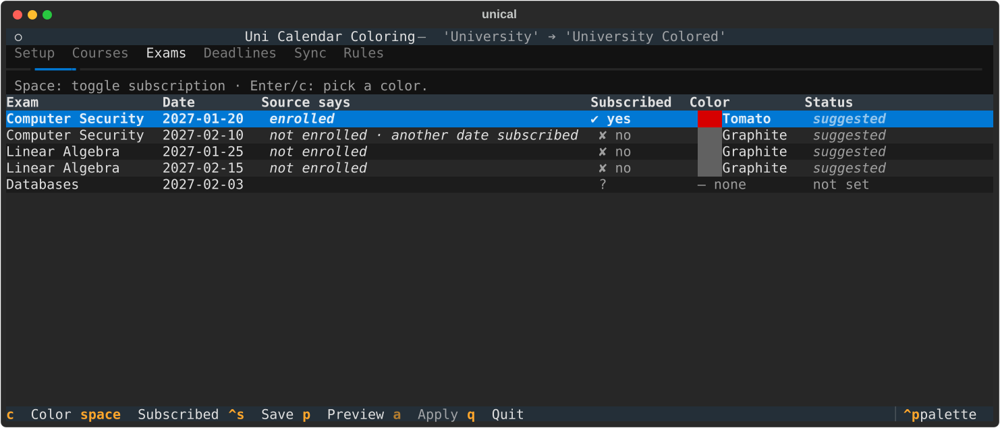

# Uni Calendar Coloring

Turn your university timetable into a color-coded Google Calendar.

The university calendar is read-only and every event in it has the same color.
This tool copies it into a Google Calendar you own and colors each event:

- **Exams**: red if you are enrolled, grey if you are not. Once you enroll in
  one session of an exam, its other sessions turn grey.
- **Lectures**: one color per course, with boilerplate stripped from the title.
- **Deadlines**: one color per deadline.

What counts as an exam, a lecture or a deadline is up to the
[rules of your profile](#profile-and-rules), so the tool can be adapted to the
format of any university. The built-in profile handles the Politecnico di
Milano format (`Esame: …`, `Lezione: Didattica - …`, `Scadenza: …`).

The profile and your choices are saved in a plain JSON file, `profile.json`, so
every later sync uses the same colors. You can run it on your laptop, from a terminal UI, or on a weekly
schedule with GitHub Actions.



## Contents

- [How it works](#how-it-works)
- [Setup](#setup)
- [Usage](#usage)
  - [Sync](#sync)
  - [Terminal UI](#terminal-ui)
  - [Interactive prompts](#interactive-prompts)
  - [Use an iCal URL as the source](#use-an-ical-url-as-the-source)
  - [Command reference](#command-reference)
- [Profile and rules](#profile-and-rules)
- [Coloring rules](#coloring-rules)
- [Configuration](#configuration)
- [Run it in the cloud with GitHub Actions](#run-it-in-the-cloud-with-github-actions)
- [Troubleshooting](#troubleshooting)
- [Development](#development)
- [Architecture](#architecture)

## How it works

```
Source calendar ──read──▶ discover ──▶ preferences ──▶ plan ──▶ apply ──write──▶ your colored calendar
(Google or iCal)          courses,      saved colors,    diff of    batched
                          exams,        rules, or        inserts/   Google API
                          deadlines     your edits       updates/   calls
                                                         deletes
```

1. **Discover**: read the source events and list the courses, exam sessions
   and deadlines they contain.
2. **Preferences**: load your saved colors and subscriptions. Anything you
   haven't chosen yet is filled in by the [coloring rules](#coloring-rules), or
   you choose it yourself in the TUI or with the `-i` prompts.
3. **Plan**: compare the source with the target calendar and work out the
   events to insert, update and delete. Unchanged events cost no API calls.
4. **Apply**: send the changes through the Google batch API, retrying
   transient failures.

The sync is safe to repeat:

- Only events the tool created are updated or deleted. They're tagged with a
  private property. Events you add to the target calendar yourself are left
  alone.
- Events removed from the source are removed from the target.
- If an event isn't covered by the current run (for example, a lecture during
  `unical exams`), it is ignored: its copy in the target calendar is
  never inserted, updated or deleted. Events removed from the source are only
  deleted by a run that covers everything.
- The target calendar is created on the first sync.

## Setup

You need **Python 3.12+** and a Google account. The tool runs under your own
Google Cloud OAuth client, so nobody else ever sees your calendar.

### 1. Create Google API credentials

1. Open the [Google Cloud Console](https://console.cloud.google.com/) and
   create a **new project**.
2. Go to **APIs & Services → Library** and enable the **Google Calendar API**.
3. Go to **APIs & Services → OAuth consent screen**:
   - Choose the **External** user type and fill in the required fields.
   - Under **Test users**, add your own Google address. If you skip this,
     login fails with `403 access_denied`.
4. Go to **APIs & Services → Credentials → Create credentials → OAuth client
   ID**, choose **Desktop app**, then download the JSON file.
5. Save it as `credentials.json` in the project directory.

### 2. Install

```bash
git clone https://github.com/Bert0ns/uni-calendar-coloring.git
cd uni-calendar-coloring
pip install ".[tui]"      # or `pip install .` if you don't want the terminal UI
```

This installs the `unical` command. `python -m unical`
works too.

### 3. First run

```bash
unical
```

Your browser opens so you can log in with Google, and the login is saved to
`token.json`. Without a browser (WSL, SSH), the login URL is printed for you to
open by hand.

The [terminal UI](#terminal-ui) then guides you through the setup:

1. **The calendar with your timetable**: pick it from your Google calendars.
2. **The calendar to write to**: pick one, or keep the suggested new name. A
   new calendar is only created when you apply the changes.
3. **Recognizing your events**: see how the built-in Politecnico di Milano
   rules classify your events, then keep them, adjust them, or start from
   scratch in the Rules tab.

The guide ends on a preview of the changes. Nothing is written to Google
Calendar until you apply them. Your choices are saved in `profile.json`, and
the guide only runs while that file doesn't exist.

Without the terminal UI, create `profile.json` yourself with the two calendars
(the rules and colors start from the built-in profile), then try a dry run:

```json
{
  "calendars": {
    "source": "My University",
    "target": "Colored Calendar"
  }
}
```

```bash
unical --dry-run
```

If you'd rather not subscribe to the source calendar in Google, give the tool
your [iCal URL](#use-an-ical-url-as-the-source) instead. All settings are listed
under [Configuration](#configuration).

> [!IMPORTANT]
> The colored calendar is a **copy** of the original calendar. In Google Calendar,
> hide the original calendar (untick it in the sidebar) to avoid seeing
> every event twice. If you use an iCal URL as the source, there is nothing to
> hide.

## Usage

### Sync

```bash
unical                       # open the terminal UI (the default)
unical --no-tui              # plain sync: exams, lectures and deadlines
unical exams --no-tui        # only (re)color exams
unical lectures --no-tui
unical deadlines --no-tui
```

Run from a terminal, `unical` opens the [terminal UI](#terminal-ui).
It falls back to a plain sync when there is no terminal (cron, CI, a pipe),
when you pass `-i`, `-n`/`--dry-run` or `--no-tui`, or when the optional `tui`
extra isn't installed. The plain sync is non-interactive. Anything new gets a
color from the [coloring rules](#coloring-rules), and that color is saved for
future runs.

Useful flags:

```bash
unical --dry-run                   # plain sync, show the changes, write nothing
unical -v                          # explain the decision for every event
unical -q                          # only warnings and errors
unical --prune-before 2026-02-01   # also delete synced events before this date
```

`--prune-before` is handy for dropping past semesters. Flags can be combined,
e.g. `unical lectures --dry-run -v`. The command exits with a non-zero
status if any calendar operation fails.

### Terminal UI

```bash
unical
unical exams          # only the Exams and Sync tabs
```

`--tui` forces it even when the shell doesn't look interactive. The TUI needs the `tui` extra (`pip install ".[tui]"`). It opens with one tab
per kind of event:

| Tab           | What you can do                                                                                                                                                                                                                                                         |
| ------------- | ----------------------------------------------------------------------------------------------------------------------------------------------------------------------------------------------------------------------------------------------------------------------- |
| **Setup**     | The calendar to read from and the one to write to. Pick them from your Google calendars, or type a new name for the target: it's created when you apply, in the time zone set here. Saved to the profile right away. The same what-to-sync selector as in the Sync tab.                                                    |
| **Courses**   | Every course in the source with its color. Pick a new color from the 11 Google colors.                                                                                                                                                                                  |
| **Exams**     | Every exam session with its date, what the source calendar says (_enrolled_ / _not enrolled_), whether you're already subscribed to another date, and your subscription. Toggle the subscription or pick a color.                                                       |
| **Deadlines** | Same as Courses, for deadlines.                                                                                                                                                                                                                                         |
| **Sync**      | Choose what to color: everything, lectures only, exams only or deadlines only (the other tabs follow). **Preview changes** lists the inserts, updates and deletes; expand an event to see its color, time and original title. **Apply** writes them to Google Calendar with a live progress panel: a spinner, a bar, how many inserts, updates and deletes are written, and the time elapsed and left.                                                                                    |
| **Rules**     | The [rules](#profile-and-rules) that decide what each event is, and the exam enrollment conditions. A live preview shows how every event title is classified. Add, edit, delete and reorder rules, or press Enter on an unmatched event to start a rule from its title. |

The **Status** column shows where each value comes from:

- **saved**: chosen earlier and stored in the profile.
- **suggested**: not chosen yet, so the coloring rules decide. It's saved at
  the next sync.
- **modified**: changed in this session and not saved yet.
- **not set**: an exam with no enrollment information. Its color is left as is
  until you choose one.

| Key           | Action                                         |
| ------------- | ---------------------------------------------- |
| `Enter` / `c` | Pick a color for the selected row              |
| `Space`       | Toggle the exam subscription (Exams tab)       |
| `Ctrl+S`      | Save rules and preferences without syncing     |
| `p`           | Preview the changes                            |
| `a`           | Apply the previewed changes                    |
| `n`           | New rule (Rules tab)                           |
| `e` / `Enter` | Edit the selected rule (Rules tab)             |
| `d`           | Delete the selected rule (Rules tab)           |
| `[` / `]`     | Move the selected rule up / down (Rules tab)   |
| `q`           | Quit (asks again if there are unsaved changes) |

Toggling a subscription switches between the default red and grey. A custom
color you picked for the exam is kept. Applying saves your preferences, just
like a normal sync. If you edit something after a preview, preview again
before applying.

### Interactive prompts

```bash
unical -i
unical exams -i
```

Without the TUI you get a question-by-question flow before the sync: your
subscription to each exam session, then a color for each course and deadline.
The current choice is the default, so you can press Enter to keep it. Other
dates of the same exam with no saved choice reuse your first answer. Add `--dry-run` to
try choices without saving them.

### Use an iCal URL as the source

You can read events straight from your personal iCal feed (e.g. from your
university app) instead of a Google calendar:

```bash
unical --ical "https://ical.example.com/<id>/<token>"
```

Or set it once in `.env`, where it takes precedence over the source calendar:

```bash
SOURCE_ICAL_URL="https://ical.example.com/<id>/<token>"
```

Recurring events (`RRULE`/`EXDATE`) are passed to Google, which expands them.
Rules can match the feed's `CATEGORIES` with `"field": "category"`; the PoliMi
profile uses them (`Lezione`, `Esame`, `Scadenza`) when the title prefixes are
missing.

> [!WARNING]
> Treat the iCal URL like a password: anyone who has it can read your
> timetable. Keep it in `.env` (which is gitignored) or in a CI secret, never
> in `profile.json`. The tool never logs it; `-v` shows only the host with the
> token redacted.

### Command reference

```
unical [all|exams|lectures|deadlines] [options]
```

| Option                                            | Description                                                                           |
| ------------------------------------------------- | ------------------------------------------------------------------------------------- |
| `all` (default), `exams`, `lectures`, `deadlines` | Which kinds of events to sync; the others are left untouched.                                           |
| `--tui`                                           | Open the terminal UI (default in a terminal). Not with `-i`, `--dry-run`, `--no-tui`. |
| `--no-tui`                                        | Run a plain sync instead of opening the terminal UI.                                  |
| `-i`, `--interactive`                             | Ask about subscriptions and colors before syncing.                                    |
| `-n`, `--dry-run`                                 | Show what would change. Nothing is written to the calendar or the profile.            |
| `--ical URL`                                      | Read from an iCal feed. Overrides the source calendar and `SOURCE_ICAL_URL`.          |
| `--prune-before YYYY-MM-DD`                       | Also delete synced events starting before this date.                                  |
| `-v`, `--verbose`                                 | Show the decision for every event.                                                    |
| `-q`, `--quiet`                                   | Show only warnings and errors.                                                        |

## Profile and rules

`profile.json` holds everything about your calendar: the calendars to sync,
the rules that classify events, and the colors and subscriptions you chose.
Without one, the tool starts from the built-in PoliMi profile and saves it on
the first sync, so you can see and edit the rules.

```json
{
  "version": 1,
  "name": "Politecnico di Milano",
  "calendars": {
    "source": "Calendar",
    "target": "Calendar Colored",
    "time_zone": null
  },
  "rules": [
    {
      "kind": "exam",
      "field": "title",
      "match": "starts_with",
      "value": "Esame: ",
      "ignore_case": false,
      "title": "{title}"
    },
    {
      "kind": "lecture",
      "field": "title",
      "match": "starts_with",
      "value": "Lezione: Didattica - ",
      "ignore_case": false,
      "title": "{name}"
    }
  ],
  "enrollment": {
    "enrolled": {
      "field": "description",
      "match": "starts_with",
      "value": "Iscritto",
      "ignore_case": false
    },
    "not_enrolled": {
      "field": "description",
      "match": "starts_with",
      "value": "Non iscritto",
      "ignore_case": false
    }
  },
  "courses": { "Computer Security": "7" },
  "exams": {
    "Computer Security (2027-01-20)": { "color": "11", "subscribed": true }
  },
  "deadlines": { "Esame di laurea": "4" }
}
```

When the target calendar doesn't exist, the first sync creates it in
`time_zone`, an [IANA time zone](https://en.wikipedia.org/wiki/List_of_tz_database_time_zones)
such as `Europe/Rome`. With `null`, it gets the time zone of your primary
Google calendar.

### Rules

Rules are checked in order and the first one that matches decides the kind of
the event. Events that match no rule are copied without a color. Without a
`rules` key, the built-in PoliMi rules apply; `"rules": []` means no rules.
The easiest way to write them is the **Rules** tab of the
[terminal UI](#terminal-ui), which shows live how each event is classified.

| Key           | Values                                                                                     |
| ------------- | ------------------------------------------------------------------------------------------ |
| `kind`        | `exam`, `lecture` or `deadline`.                                                           |
| `field`       | What to look at: `title`, `description`, `location` or `category` (any iCal category).     |
| `match`       | `starts_with`, `contains`, `equals` or `regex` (a Python regular expression, searched).    |
| `value`       | The text or regular expression to match.                                                   |
| `ignore_case` | `true` to ignore upper/lower case. Optional, `false` by default.                           |
| `title`       | Title in the colored calendar. `{title}` is the original title, `{name}` the event's name. |

The **name** of an event identifies its course, exam or deadline: lectures with
the same name share a color. It's the title without the matched text when the
rule looks at the title (`Lezione: Didattica - Algebra` → `Algebra`), and the
whole title otherwise. With a `regex`, a `(?P<name>…)` group picks it out
explicitly, e.g. `^\[\w+\] (?P<name>.+) - Lecture$` turns
`[CS101] Algorithms - Lecture` into `Algorithms`.

`enrollment` is optional: it tells, from an exam event, whether you're enrolled
(`enrolled`) or not (`not_enrolled`). Each is a condition like the ones of the
rules, or `null`. Invalid rules are skipped with a warning.

## Coloring rules

These rules fill in anything you haven't chosen yourself. Your saved choices
always win.

| Event                                                 | Rule                                                                     |
| ----------------------------------------------------- | ------------------------------------------------------------------------ |
| Exam, another session of an exam you're subscribed to | Not subscribed, **Graphite** (grey). Checked first.                      |
| Exam, the `enrolled` condition matches                | Subscribed, **Tomato** (red).                                            |
| Exam, the `not_enrolled` condition matches            | Not subscribed, **Graphite**.                                            |
| Exam, no information                                  | Left uncolored until you choose.                                         |
| Lecture                                               | A color derived from the course name, so it's the same on every machine. |
| Deadline                                              | A color derived from the name.                                           |

### Saved preferences

| Profile key | Content                                                                 |
| ----------- | ----------------------------------------------------------------------- |
| `courses`   | `{"<course>": "<color id>"}`                                            |
| `exams`     | `{"<exam name> (<YYYY-MM-DD>)": {"color": "<id>", "subscribed": true}}` |
| `deadlines` | `{"<deadline>": "<color id>"}`                                          |

Color IDs are Google's: 1 Lavender, 2 Sage, 3 Grape, 4 Flamingo, 5 Banana,
6 Tangerine, 7 Peacock, 8 Graphite, 9 Blueberry, 10 Basil, 11 Tomato. You can
edit the file by hand. Invalid entries are skipped with a warning, and the file
is written atomically, so an interrupted run can't corrupt it.

## Configuration

The calendars, rules and colors live in the [profile](#profile-and-rules). The
optional settings below come from environment variables, usually set in `.env`
(see `.env.example`). Relative paths are resolved from the directory you run
the command in.

| Variable               | Default            | Description                                     |
| ---------------------- | ------------------ | ----------------------------------------------- |
| `PROFILE_PATH`         | `profile.json`     | The profile.                                    |
| `SOURCE_CALENDAR_NAME` | _(the profile's)_  | Overrides the calendar to read from.            |
| `TARGET_CALENDAR_NAME` | _(the profile's)_  | Overrides the calendar to write to.             |
| `SOURCE_ICAL_URL`      | _(unset)_          | Read from this iCal feed instead of a calendar. |
| `CREDENTIALS_PATH`     | `credentials.json` | OAuth client downloaded from Google Cloud.      |
| `TOKEN_PATH`           | `token.json`       | Cached Google login.                            |

## Run it in the cloud with GitHub Actions

The repository includes a workflow,
[`.github/workflows/manual_sync.yml`](.github/workflows/manual_sync.yml), that
syncs **every Monday at 06:00 UTC**. You can also run it from the **Actions**
tab and choose the target, verbose output, or a dry run.

1. Log in locally once so that `token.json` exists, e.g. with
   `unical --dry-run`.
2. In your fork, go to **Settings → Secrets and variables → Actions** and add
   these repository secrets:

   | Secret                 | Value                                                       |
   | ---------------------- | ----------------------------------------------------------- |
   | `GCP_CREDENTIALS_JSON` | Contents of `credentials.json`.                             |
   | `GCP_TOKEN_JSON`       | Contents of `token.json`.                                   |
   | `SOURCE_CALENDAR_NAME` | Optional, overrides the profile's source calendar.          |
   | `TARGET_CALENDAR_NAME` | Optional, overrides the profile's target calendar.          |
   | `SOURCE_ICAL_URL`      | Optional. If set, it's used instead of the source calendar. |

After each run, the workflow commits the updated `profile.json` back to the
repository, so colors you pick locally (and push) and colors the cloud run
assigns stay in sync.

> [!NOTE]
> While your OAuth app is in **Testing** mode, Google expires the login after
> 7 days. The cloud run can't open a browser, so it then fails with a "login
> required" message. Run the tool locally to log in again and update the
> `GCP_TOKEN_JSON` secret.

## Troubleshooting

| Problem                                                   | Fix                                                                                                          |
| --------------------------------------------------------- | ------------------------------------------------------------------------------------------------------------ |
| `403 access_denied` when logging in                       | Add your Google address as a **Test user** on the OAuth consent screen.                                      |
| `OAuth client file 'credentials.json' not found`          | Download the Desktop OAuth client JSON and save it as `credentials.json`, or point `CREDENTIALS_PATH` to it. |
| `Source calendar '…' not found`                           | The source calendar in `profile.json` must match the name exactly as shown in Google Calendar.               |
| Every event shows up twice                                | Hide the original calendar in Google Calendar.                                                               |
| `Could not download iCal feed`                            | The iCal URL may have expired or been revoked. Generate a new one.                                           |
| `The terminal UI needs the optional 'textual' dependency` | Run `pip install ".[tui]"`.                                                                                  |
| Login keeps expiring after a week                         | That's Google's Testing mode: log in again locally (and update `GCP_TOKEN_JSON` if you use GitHub Actions).  |

> Upgrading from an older version? `token.pickle` is migrated to `token.json`
> automatically, and the old `GCP_TOKEN_PICKLE_B64` secret is still accepted.
> Events synced by older versions carry an older tag: the next sync updates
> each of them once to the current tag, then they're left alone again.

## Development

```bash
pip install -e ".[dev,tui]"
pytest          # unit, golden regression and Textual pilot tests
mypy            # strict type checking
ruff check .    # linting
black .         # formatting
pre-commit install
```

CI runs all of the above on Python 3.12 and 3.14 and requires 95% test
coverage.

## Architecture

The core never prints, prompts or touches the network directly. It depends on
small interfaces (ports) that the adapters implement, so the CLI, the
interactive prompts and the TUI are all thin frontends over the same
discover → preferences → plan → apply phases.

```
src/unical/
├── palette.py         # GoogleColor: the 11 Google colors (id, name, RGB)
├── events.py          # Event accessors and exam sessions
├── rules.py           # Classification rules: event → exam/lecture/deadline + name
├── presets.py         # Built-in rules (Politecnico di Milano)
├── profile.py         # Profile model + JSON repository (atomic writes)
├── catalog.py         # Discover: courses, exam sessions and deadlines in the source
├── preferences.py     # Preferences model: colors and exam subscriptions
├── suggestions.py     # Pure rules for default colors and subscriptions
├── resolution.py      # Fill in preferences the user never chose
├── strategies.py      # Pure lookups: event + preferences → color
├── workflow.py        # Use case: load, preview/plan, apply (and run = all at once)
├── reporting.py       # Reporter port (progress and messages)
├── sync/
│   ├── source.py      # EventSource port + Google calendar source
│   ├── planner.py     # Pure diff: source + target events → SyncPlan
│   ├── models.py      # Mutation, SyncPlan, SyncResult value objects
│   ├── gateway.py     # CalendarGateway port
│   └── service.py     # Target-calendar I/O around the planner, with progress
├── ical_source.py     # iCal feed source (standard library parser)
├── google_client.py   # Google Calendar adapter (batch requests + retries)
├── auth.py            # Google OAuth, Desktop flow, token.json
├── config.py          # Settings and overrides from environment variables
├── cli/
│   ├── main.py        # Argument parsing and wiring of the adapters
│   ├── prompts.py     # Interactive preference editor (-i)
│   ├── console.py     # Colored console reporter
│   └── ansi.py        # ANSI styling helpers
└── tui/               # Optional: pip install ".[tui]"
    ├── model.py       # View model of the editor (pure Python, no Textual)
    ├── widgets.py     # Color picker, plan tree, swatches
    └── app.py         # Textual app: tabs, workers, reporter
```

## License

[MIT](LICENSE)
